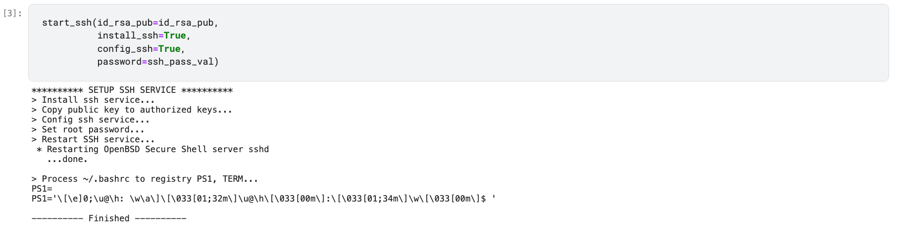
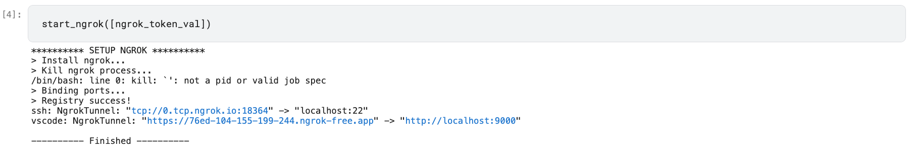

# Run Kaggle on VS Code

Source: [github.com/dntai/resyslab_utils](https://github.com/dntai/resyslab_utils)

## 1. GitHub configuration
- Create a SSH key for GitHub by **the Ed25519 algorithm**. (_Note_: Setting the types of passwords is not necessary. So press **Enter** to skip them all.) 
```
ssh-keygen -t ed25519 -C "your_email@example.com"
```

- At **/your_user/.ssh**, copy the content in **id_ed25519.pub** and add to your GitHub account.


- Open Terminal at **/your_user/.ssh** and run the following command.
```
cat id_ed25519 | base64
```

- Then add the result to **the Secrets section** of Kaggle. (Reference: [Feature Launch: User Secrets](https://www.kaggle.com/discussions/product-feedback/114053))


## 2. Kaggle configuration
- Create a SSH key for Kaggle by **the RSA algorithm**. (_Note_: Setting the types of passwords is not necessary. So press **Enter** to skip them all.)
```
ssh-keygen -t rsa -b 4096 -f ~/.ssh/id_rsa
```

- At **/your_user/.ssh**, copy the content in **id_rsa.pub** and add to **the Secrets section** of Kaggle.

## 3. Ngrok configuration
- Create a **ngrok** account.
- Afterwards, copy **the ngrok token** at [Getting Started/Your Authtoken](https://dashboard.ngrok.com/get-started/your-authtoken) and add it to **the Secrets section** of Kaggle.

## 4. Connect from the local computer to the Kaggle server
- Run all cells in examples/kaggle_enfit23_setup.ipynb. The results like that:





## References
- [x] Hoàng Đông Phạm. [Introduction to ngrok](https://www.youtube.com/watch?v=HxHH8e4cOds). YouTube.
- [x] Xuanthulab. [Introduction to SSH](https://www.youtube.com/watch?v=x20NiW2BM3Y). YouTube.
- [x] Ký sự AI. [Cấu hình VS Code để lập trình trên server bằng Remote - SSH](https://www.kysuai.com/2020/12/26/Cau-hinh-VS-Code-de-code-tren-server/). kysuai.com
- [x] Kaggle. [Feature Launch: User Secrets](https://www.kaggle.com/discussions/product-feedback/114053). kaggle.com.
- [ ] convergeML. [How to run Google Colab or Kaggle notebooks on VSCODE](https://www.youtube.com/watch?v=DuhpUatEaL0). YouTube.
- [ ] Abhishek Thakur. [VS Code (codeserver) on Google Colab / Kaggle / Anywhere](https://www.youtube.com/watch?v=7kTbM3D02jU). YouTube.
